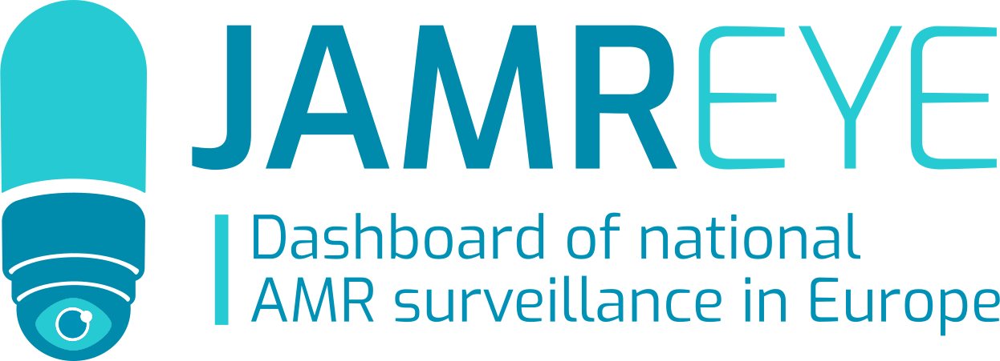

---
format:
  html:
    embed-resources: false

execute:
  cache: false
  echo: false
  warnings: false
  error: false
---

```{r}
#| results: "asis"
#| echo: false
#| warning: false
#| message: false
source("../../_common.R")
status(type = "ready2publish")

```


::: {.callout-note appearance="simple" collapse="false" #infoc-jamrai}
## [In-focus]{.in-focus} - JAMRAI 2 {.unnumbered}  


### EU-JAMRAI 2: European collaboration for implementing measures against antimicrobial resistance

::: {.column-margin}
{#fig-jamrai-logo width="100%"}

:::

#### EU-<span style="color:#0fdbd5">JAMRAI 2</span> in Brief

EU-JAMRAI 2 (Joint Action on Antimicrobial Resistance and Healthcare-Associated Infections) is a European initiative aimed at strengthening countries efforts to prevent healthcare-associated infections and antimicrobial resistance (AMR) from a One Health perspective (@fig-jamrai-logo). The initiative is central to fulfilling the EU Council recommendation on AMR and brings together approximately 120 partner organisations across 30 countries. Sweden participates through the Public Health Agency of Sweden, the National Board of Health and Welfare, the Swedish Veterinary Agency (SVA), the Medical Products Agency and the Swedish Research Council, contributing to all aspects of the work. The Public Health Agency of Sweden plays a leading role, co-leading two work packages and overseeing the Swedish efforts.

For more information, please visit [www.eu-jamrai.eu](https://eu-jamrai.eu/){target="_blank"}.

#### Strengthened Surveillance from a One Health Perspective

::: {.column-margin}
{#infocfig-jamreye width="80%"}

:::

The Public Health Agency of Sweden is co-leading the work package on One Health surveillance of AMR, with the goal of achieving stronger, more purposeful, and comprehensive AMR surveillance in humans, animals, and the environment across Europe. This includes establishing two new European surveillance systems for AMR: one for clinical infections in animals (EARS-Vet) and one for the environment (EARS-Env). The work also involves improving national One Health reporting in Europe and developing indicators to harmonise and advance One Health analyses. Notably, the digitisation of the annual report, Swedres-Svarm, has been made possible through funding from JAMRAI.

The EARS-Vet part of JAMRAI 2 aims to fill in a gap on AMR surveillance in bacterial pathogens of animals in Europe. More specifically, EARS-Vet aims to report on the AMR situation, follow AMR trends and detect emerging AMR in bacterial pathogens of animals in Europe. For example, EARS-Vet will support antimicrobial stewardship programs in veterinary medicine, generate minimum inhibitory concentration (MIC) distributions as a basis for setting epidemiological cut-off values (ECOFFs) and clinical breakpoints (CBP) for the interpretation of AST results in veterinary medicine, and estimate the burden of AMR in animal health. Hence, EARS-Vet intends to complement the existing antimicrobial resistance and consumption surveillance systems by covering animal species, bacterial pathogens of animals and antibiotics of relevance to veterinary and human medicine, which are not included in other European monitoring programs.

Sweden is also involved in EARS-Env were possibilities for harmonised monitoring of anthropogenic impact on occurrence of AMR in the environment is discussed.
To strengthen AMR surveillance in humans in Europe, the Public Health Agency of Sweden, together with colleagues in Luxembourg, has created the public dashboard [JAMREYE](https://eu-jamrai.eu/surveillance/surveillance-dashboard/){target="_blank"}, which displays national AMR surveillance in 30 European countries. This tool can be used to identify gaps in surveillance and monitor countries' implementation of policy commitments (@infocfig-jamreye).

#### Improved Access to Antibiotics

Within the [work package on access](https://eu-jamrai.eu/access/){target="_blank"}, which Public Health Agency of Sweden is co-leading, Sweden and other participating countries have identified national barriers to sustainable access to certain older priority antibiotics for human and veterinary use, as well as veterinary vaccines. This has provided an important foundation for identifying appropriate measures to achieve more sustainable and strengthened access to these products. The focus is now on developing and implementing these targeted measures both nationally and jointly. The Public Health Agency of Sweden and the Medical Products Agency are working on national efforts as well as a Nordic collaboration on reimbursement models and other measures to strengthen access to antibiotics for human and veterinary use.


#### Other Engagement within EU-JAMRAI 2

Sweden is also involved in other work packages, including infection prevention and control and behavioural change. The Public Health Agency of Sweden and the National Board of Health and Welfare, together with two long-term care facilities, have identified barriers and drivers for implementing infection control measures from a behavioural science perspective, with a focus on hand hygiene before patient contact. The Public Health Agency of Sweden is also contributing to the establishment of a support program for all 30 participating countries aimed at sharing experiences and strengthening the European collaboration. Additionally, the agency contributes to the communication efforts within EU-JAMRAI 2 by creating and disseminating knowledge about antimicrobial resistance to the public.

Finally, SVA is involved in a work package on Antimicrobial Stewardship in animal health, where antibiotic resistance is counteracted by improving infection prevention and control (IPC) and antimicrobial stewardship programs (ASP) in veterinary medicine. Published knowledge as well as key structures and competences for successful IPC and ASP strategies have been identified. Framework documents describing such strategies are currently being drafted based on these findings.

:::